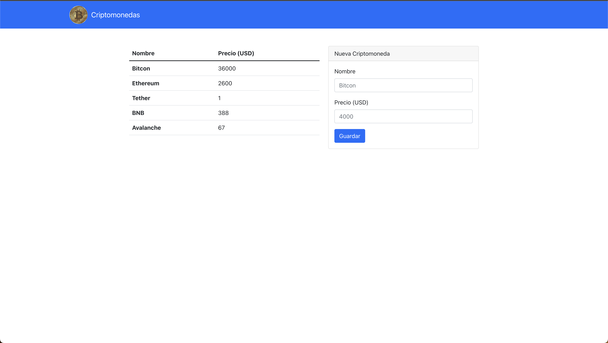

# Full Stack Developer (Criptomonedas)

Este proyecto esta desarrolla para una prueba técnica.

## FUNCIONALIDAD

### Backend

Cuenta con los siguiente ENDPOINT

- (Get) `http://localhost:8000/crypto` Obtiene todos las criptomonedas.
- (Post) `http://localhost:8000/crypto` Crea una nueva criptomoneda.

### Frontend

- Tabla que muestra todas las criptomonedas.
- Formulario para ingresar una nueva criptomoneda.

## Demo

## Uso

- Abrir una terminal.

- Clone el repositorio localmente como sigue:
  - `git clone https://github.com/BrangyCastro/criptomoneda.git`

### Backend

- Ir a la carpeta del proyecto:
  - `cd /criptomoneda/backend`
- Instalar los paquetes del proyecto:
  - `npm install`
- Ejecutar el proyecto en producción:
  - `npm run start:prod`
- o tambien ejecutar el proyecto en deserrollo:
- `npm run start:dev`
- Url habilitada:
  - `http://localhost:8000/`

### Frontend

- Ir a la carpeta del proyecto:
  - `cd /criptomoneda/frontend`
- Instalar los paquetes del proyecto:
  - `npm install`
- Ejecutar el proyecto:
  - `npm run start`
- Abra la aplicación en su navegador:
  - `http://localhost:3000/`

## Tecnologías:

### Backend

- [Express](http://expressjs.com/)

### Frontend

- [React.js](https://reactjs.org/)

## Author

🇪🇨 **Brangy Castro** [Sitio Web](https://brangycastro.netlify.app/)

[GitHub](https://github.com/BrangyCastro)
[Linkedin](https://www.linkedin.com/in/brangycastro/)
[Twitter](https://twitter.com/BrangyC)
[Facebook](https://www.facebook.com/brangy.castro/)
[Behance](https://www.behance.net/brangycastro)
[Dribbble](https://dribbble.com/BrangyC)
